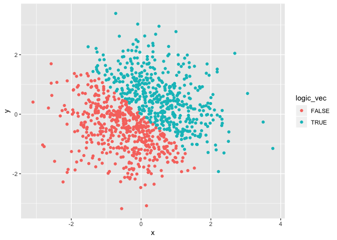
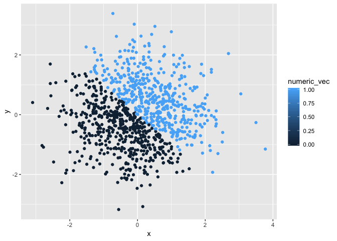
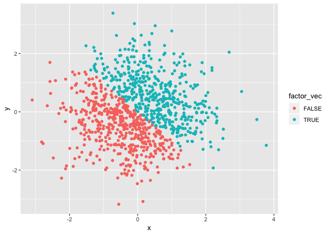

p8105\_hw1\_xz2788
================
Xiaoyue Zhang
9/15/2018

``` r
library(tidyverse)
```

    ## ── Attaching packages ───────────────────────────────────────────────── tidyverse 1.2.1 ──

    ## ✔ ggplot2 3.0.0     ✔ purrr   0.2.5
    ## ✔ tibble  1.4.2     ✔ dplyr   0.7.6
    ## ✔ tidyr   0.8.1     ✔ stringr 1.3.1
    ## ✔ readr   1.1.1     ✔ forcats 0.3.0

    ## ── Conflicts ──────────────────────────────────────────────────── tidyverse_conflicts() ──
    ## ✖ dplyr::filter() masks stats::filter()
    ## ✖ dplyr::lag()    masks stats::lag()

Section 1
=========

This section displays the answer to problem 1

Taking the mean
---------------

Here is a **code chunk** that creats a dataframe

``` r
hw1_df_1 = tibble(
  numeric_vec = runif(10, 0, 5),
  logic_vec = numeric_vec > 2,
  char_vec = character(length = 10),
  factor_vec = factor(c(1, 2, 2, 2, 2, 1, 1, 3, 1, 2), labels = c("I","II","III"))
)
```

take the mean of each variable in the dataframe

``` r
mean(hw1_df_1$numeric_vec)
```

    ## [1] 2.54864

``` r
mean(hw1_df_1$logic_vec)
```

    ## [1] 0.7

``` r
mean(hw1_df_1$char_vec)
```

    ## Warning in mean.default(hw1_df_1$char_vec): argument is not numeric or
    ## logical: returning NA

    ## [1] NA

``` r
mean(hw1_df_1$factor_vec)
```

    ## Warning in mean.default(hw1_df_1$factor_vec): argument is not numeric or
    ## logical: returning NA

    ## [1] NA

### Results of taking the mean of each variable:

We can take the mean of a random sample from uniform distribution and a logical vector, but it didn't work with a character vector and a factor vector.

Explanation:

In R, mean of a vector is the average or arithmetic mean of elements in the vector.

A random sample of a uniform distribution is a numerical vector. So you can take the mean of this vector.

For a logical vector, TRUE is considered as 1 and FALSE is considered as 0 in R. So you can still take the arithmetic mean of these elements.

For a character vector, each element in the vector is a string of one or more characters instead of being considered as numbers. So R can't take the mean of characters.

Factors in R are stored as a vector of integer values with a corresponding set of character values to use when the factor is displayed. Factor's levels are always in character values and R can't take the mean of characters.

Converting vectors
------------------

Here is a **code chunk** that applies the as.numeric function:

``` r
## why can't use results = hide, the message said that hide not found
as.numeric(hw1_df_1$logic_vec)
as.numeric(hw1_df_1$char_vec)
as.numeric(hw1_df_1$factor_vec)
```

### What happens?

The character vector was presented with NAs. The logical vector displays "1" for TRUE and "0" for FALSE. The factor vector was presented with corresponding value of levels.

Here is a **code chunk** that converts character variable to factor to numeric:

``` r
char_to_factor = as.factor(hw1_df_1$char_vec)
as.numeric(char_to_factor)
```

    ##  [1] 1 1 1 1 1 1 1 1 1 1

Here is a **code chunk** that converts factor to character to numeric:

``` r
factor_to_char = as.character(hw1_df_1$factor_vec)
as.numeric(factor_to_char)
```

    ## Warning: NAs introduced by coercion

    ##  [1] NA NA NA NA NA NA NA NA NA NA

### What happens through converting?

All the elements in character vector is converted to numerical variables with value of "1" and the factor vector is converted to a numerical vector with NAs. Because the character is considered as only a character instead of numbers in R and the factors can convert to numerical according to its corresponding levels.

Section 2
=========

This section displays the answer to problem 2

``` r
hw1_df_2 = tibble(
  x = rnorm(1000),
  y = rnorm(1000),
  logic_vec = x + y > 0,
  numeric_vec = as.numeric(logic_vec),
  factor_vec = as.factor(logic_vec)
)
```

The size of the dataset is 1000, 5 or 1000 \* 5

The mean of x is 0.0367543 and the median of x is 0.0313368

The proportion of cases for which the logical vector is TRUE is 0.514

Making scatterplots:
--------------------

``` r
ggplot(hw1_df_2, aes(x = x, y = y, color = logic_vec)) + geom_point()
```



``` r
ggsave("scatter_plots_1.pdf", height = 4, width = 6)
ggplot(hw1_df_2, aes(x = x, y = y, color = numeric_vec)) + geom_point()
```



``` r
ggplot(hw1_df_2, aes(x = x, y = y, color = factor_vec)) + geom_point()
```



Comments on color scale:
------------------------

For all these three scatter plots, the two different color points are even distributed in the plots. All the false elements or numeric vector with value of zero are presented at the lower left corner and the others are displayed at the upper right corner.
